# AskAithena System Architecture

This document contains the system architecture diagram for Aithena Services, including AskAIthena, AIthena Hub (MCP Dashboard) and the GARD Chatbot.

This shows the current state of the system on the Polus1 and Polus2 development servers, showing the relationships between various services, databases, and components.

## Architecture Overview

The AskAithena platform is designed as a microservices architecture with the following key components:

- **Frontend Applications**: User-facing applications for chat, AI review, and question answering
- **API Services**: Core services providing AI capabilities and data processing
- **AI Backend**: LiteLLM for utilization tracking and a common gateway to external and local LLMs
- **Data Layer**: PostgreSQL for structured data and vector search (with pgvector)
- **Data Ingestion**: Jobs for processing academic papers from arXiv and OpenAlex

## System Architecture Diagram

**NOTE:** This does not include ALL applications currently being served. For example, the structured extraction application is not included, but has a frontend React UI and backend FastAPI set of containers like the GARD Chatbot and AskAithena.

All elements are containerized with Docker (except the disk)

```mermaid
architecture-beta
    group nih_firewall(logos:aws-vpc)[NIH Firewall]
    group polus1(server)[polus1] in nih_firewall
    group polus2(server)[polus2] in nih_firewall
    group external1(server)[External APIs]
    group external2(server)[External APIs]

    service user(logos:yarn)[User] in nih_firewall

    service nginx1(logos:nginx)[nginx] in polus1
    service nginx2(logos:nginx)[nginx] in polus2

    service postgres1(logos:postgresql)[Postgres pgvector] in polus1
    service postgres2(logos:postgresql)[Postgres pgvector] in polus2
    service disk1(disk)[disk] in polus1
    service disk2(disk)[disk] in polus2
    service minio1(disk)[MinIO] in polus1
    service minio2(disk)[MinIO] in polus2
    service rabbitmq1(logos:rabbitmq-icon)[RabbitMQ] in polus1
    service rabbitmq2(logos:rabbitmq-icon)[RabbitMQ] in polus2
    service litellm1(logos:nodebots)[LiteLLM] in polus1
    service ollama1(logos:nodebots)[Ollama] in polus1
    service litellm2(logos:nodebots)[LiteLLM] in polus2
    service ollama2(logos:nodebots)[Ollama] in polus2

    service aithenahub(logos:react)[Aithena Hub] in polus1
    service gardchat(logos:react)[GARD Chatbot] in polus1
    service sequentialmcp(logos:docker)[Sequential Thinking MCP] in polus1
    service askaithenamcp(logos:docker)[Ask AIthena MCP] in polus1
    service timemcp(logos:docker)[Time MCP] in polus1
    service askaithena(logos:react)[Ask Aithena] in polus2
    service askaithenaapi(logos:fastapi-icon)[Ask Aithena API] in polus2
    service gardapi(logos:fastapi-icon)[GARD Chatbot API] in polus1

    service openai1(logos:openai)[ChatGPT] in external1
    service anthropic1(logos:anthropic-icon)[Claude] in external1
    service awsbedrock1(logos:aws-sns)[AWS Bedrock] in external1
    service openai2(logos:openai)[ChatGPT] in external2
    service anthropic2(logos:anthropic-icon)[Claude] in external2
    service awsbedrock2(logos:aws-sns)[AWS Bedrock] in external2

    junction j1p1mcp in polus1
    junction j2p1mcp in polus1
    junction jexternal1 in external1
    junction jexternal2 in external2

    jexternal1:B -- T:openai1
    jexternal1:L -- R:anthropic1
    jexternal1:R -- L:awsbedrock1
    jexternal2:T -- B:openai2
    jexternal2:B -- T:anthropic2
    jexternal2:R -- L:awsbedrock2

    nginx2:T -- B:askaithena
    nginx2:B -- T:minio2
    askaithenaapi:B -- T:postgres2
    askaithena:T -- B:rabbitmq2
    minio2:L -- R:disk2
    askaithena:L -- R:askaithenaapi
    askaithenaapi:T -- B:litellm2
    litellm2:T -- B:ollama2
    askaithenaapi:R -- L:rabbitmq2
    litellm2:R -- L:jexternal2

    nginx2:L -- R:user
    nginx1:R -- L:user

    nginx1:T -- B:j1p1mcp
    j1p1mcp:L -- R:j2p1mcp
    j1p1mcp:T -- B:askaithenamcp
    j2p1mcp:T -- B:sequentialmcp
    j1p1mcp:R -- L:aithenahub
    j2p1mcp:L -- R:timemcp
    nginx1:L -- R:minio1
    minio1:B -- T:disk1
    askaithenamcp:R -- L:askaithenaapi
    litellm1:L -- R:ollama1
    gardapi:R -- L:rabbitmq1
    gardchat:R -- L:rabbitmq1
    gardapi:B -- T:litellm1
    gardchat:B -- T:gardapi
    postgres1:R -- L:gardapi
    gardchat:T -- B:nginx1
    litellm1:B -- T:jexternal1
```

## Component Descriptions

### Frontend Applications
- **Chat App**: A basic chat app for testing AI models
- **Ask Aithena App**: Specialized application for question-answering on the AskAithena database
- **AI Review App**: Application for AI-assisted document review
- **GARD Chatbot**: 

### API Layer
- **Aithena Services**: Core API services providing AI capabilities
- **Ask Aithena Agent**: Specialized agent for handling question-answering requests

### AI Backend
- **LiteLLM**: Serves as a common API gateway for AI models. Makes it easy to switch between models without changing code.
- **Ollama Backend**: Serve local AI models with the Ollama framework

### Data Layer
- **PostgreSQL**: Relational database for structured data storage
- **MinIO**: High performance, local blob storage with S3-like adapter so that an S3 bucket can be swapped in place

### Data Ingestion
- **ArXiv Embedding Job**: Processes and embeds arXiv papers
- **OpenAlex Embedding Job**: Processes and embeds OpenAlex academic data
- **OpenAlex Data Job**: Ingests structured data from OpenAlex

## Deployment

The system is designed to be deployed using:
- **Kubernetes/Helm**: For orchestration and deployment
- **Docker**: For containerization
- **SLURM**: For HPC environments (optional)

All components include Helm charts for easy deployment and scaling.

