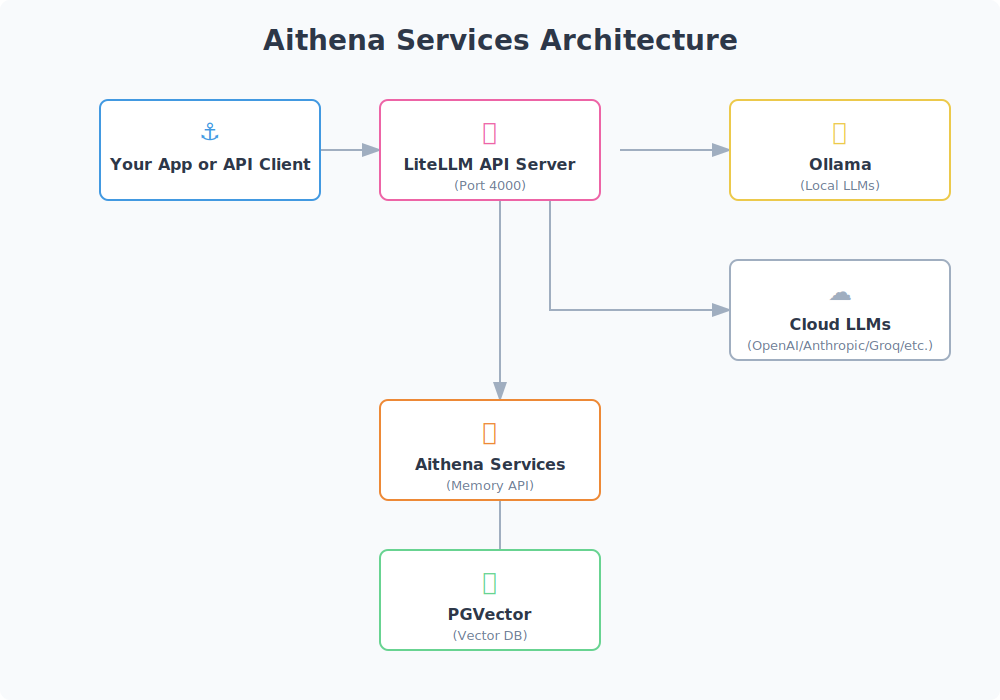

# Aithena Services Documentation

<p align="center">
  
  
</p>

Welcome to the Aithena Services documentation. Aithena Services is a specialized component that provides vector memory and database functionality for AI applications. It works seamlessly with LiteLLM for a complete AI development environment.

## Deployment Options

Aithena Services offers two primary deployment options:

1. **Complete Stack with Docker Compose**: Deploy the entire AI development stack including Ollama, LiteLLM, and Aithena Services for vector memory.
2. **Memory Component Only**: Use Aithena Services as a standalone memory service and configure LiteLLM independently.

## Documentation Sections

### Getting Started
- [Quick Start Guide](quickstart.md) - Get up and running with Aithena Services
- [Docker Compose Setup](docker_compose.md) - Detailed instructions for deploying the complete stack

### Core Concepts
- [API Reference](api.md) - Memory API endpoints documentation
- [Memory and Vector Database Features](memory.md) - Using vector databases for storing and retrieving embeddings

### Configuration and Structure
- [Environment Variables](env.md) - Configuring Aithena Services with environment variables
- [Project Structure](structure.md) - Overview of the codebase structure and main components

## Current System Architecture



## Project Structure

The current Aithena Services focuses on:

```
src/aithena_services/
├── api/            - FastAPI endpoints for memory operations
├── memory/         - Vector database functionality
│   └── pgvector.py - PostgreSQL vector database implementation
└── common/         - Shared utilities and helpers
```

## Key Features

- **Vector Memory**: Store and retrieve embeddings using PostgreSQL with pgvector
- **Similarity Search**: Efficient cosine similarity search for vectors
- **Integration with LiteLLM**: Works with LiteLLM for a complete AI development environment
- **Docker-Ready**: Easy deployment with Docker Compose

## Getting Help

If you encounter issues or have questions:

1. Check the [Quick Start Guide](quickstart.md) for common issues and solutions
2. Refer to the [Docker Compose Setup](docker_compose.md) for deployment help
3. Submit an issue on our GitHub repository 